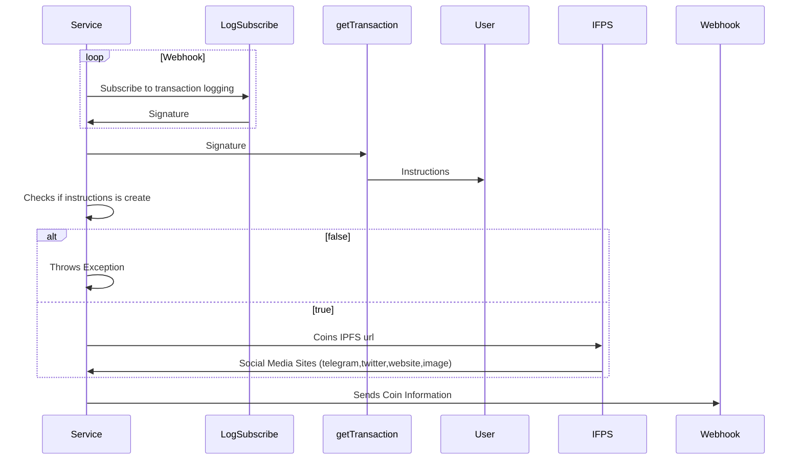

```mermaid
sequenceDiagram

    loop Webhook
        Service->>LogSubscribe: Subscribe to transaction logging
        LogSubscribe->>Service: Signature
    end

    Service->>getTransaction: Signature
    getTransaction->>User: Instructions

    Service->>Service: Checks if instructions is create
    alt false
        Service->>Service: Throws Exception
    else true
        Service->>IFPS: Coins IPFS url
        IFPS->>Service: Social Media Sites (telegram,twitter,website,image)
    end

    Service->>Webhook: Sends Coin Information
```
